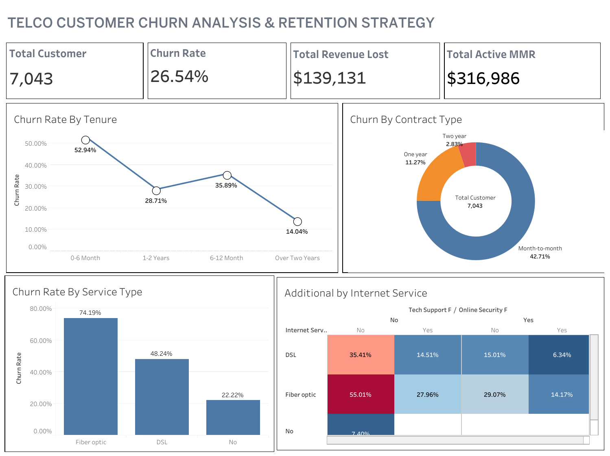

# Telco Customer Churn Analysis

## Background

A telecom company is facing a high number of customers leaving their service (churn). This is a serious problem because churn directly reduces monthly revenue and increases customer acquisition costs.

In this project, I analyzed customer data to understand **why customers leave**, **which groups are most at risk**, and **what actions the company could take to improve retention**.

---

## Problem Statement

The company wants to answer several key questions:

* Which types of customers churn the most?
* Does contract type affect retention?
* Are certain internet services linked to higher churn?
* When are customers most likely to leave?
* How much revenue is lost due to churn?

---

## Approach

I used SQL to explore and segment the data, focusing on:

* Overall churn rate and revenue impact
* Churn by contract type
* Churn by internet service
* Churn patterns based on customer tenure
* Combined analysis of services and contract types

The results were then summarized in a dashboard for easier interpretation.

---

## Key Findings

* Customers with **month-to-month contracts** have the highest churn rate.
* **Fiber optic users** are more likely to churn compared to other service types.
* Many customers leave within their **first 6 months**.
* Customers without **tech support or online security** churn more often.

---

## Possible Solutions

Based on the analysis, the company could:

* Encourage customers to switch to longer contracts
* Improve the onboarding experience for new users
* Offer bundled services that include tech support and security
* Focus retention campaigns on high-risk customer segments

---

## Tools Used

* SQL for data analysis
* Tableau / Power BI for dashboard visualization
* Excel as the dataset source

---

## Repository Structure

* `/data` → raw dataset
* `/sql` → SQL scripts
* `/dashboard` → dashboard screenshots

---

## Dashboard Preview

---

## Author

Muhamad Fauzan Rafli
